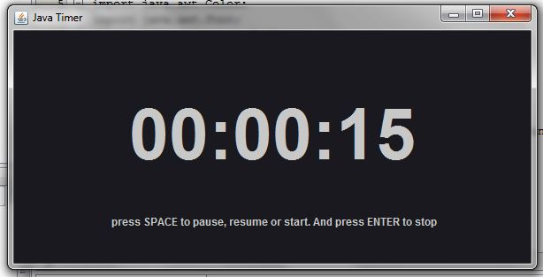

## Java Timer

 
This is a small basic JAVA timer. To try to test out the speed efficiency of the different GUI libraries in Java.
  

-------------------

<strong>Screenshots:</strong>

  

</a>

  

</a>
 